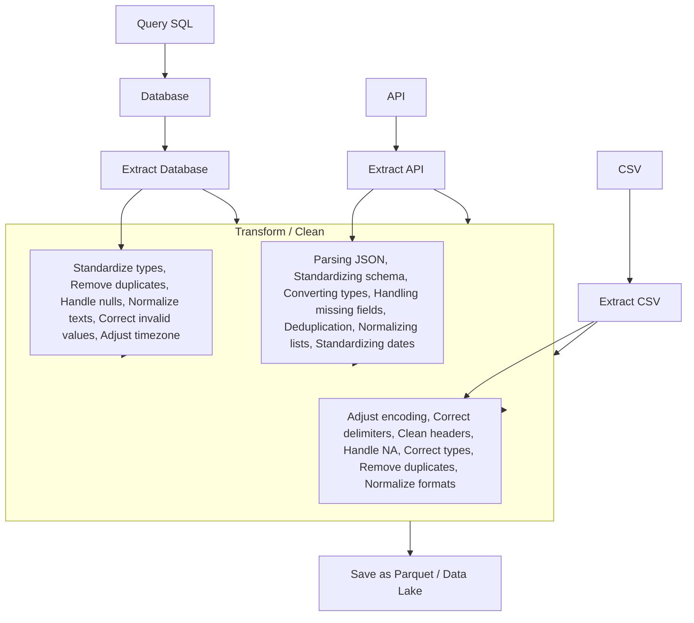
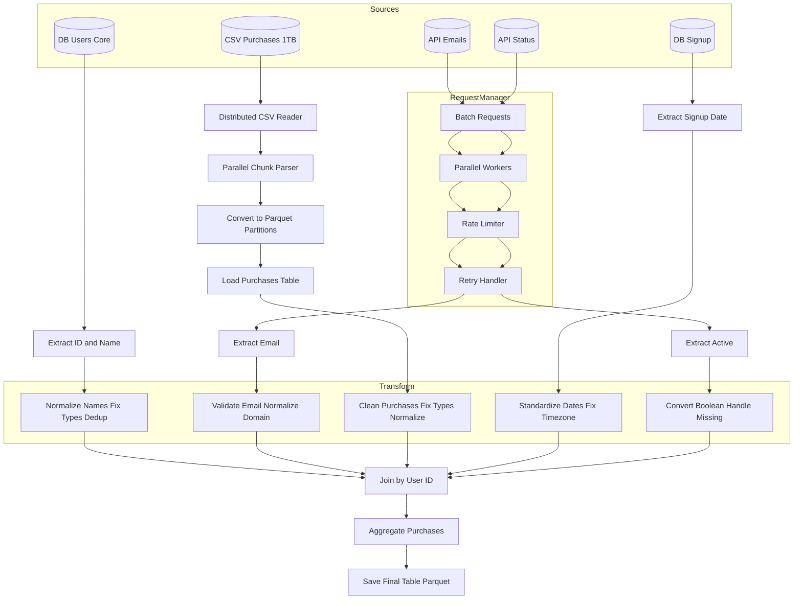

# poc-data

## Mermaid Code: Same data different source



## Examples

### Database
```sql
id | name            | email                | signup_date                | active | purchases
---+-----------------+----------------------+----------------------------+--------+---------
1  | Luiz Gabriel    | luiz@email.com       | 2023-05-10 14:25:00        | true   | 1530.75
2  | Joao            | joao@email.com       | 2023-06-21 09:10:00        | false  | 245.00
3  | Gabriel         | gabriel@email.com    | 2023-07-02 18:40:00        | true   | 999.90

```

### csv
```
id;name;email;signup_date;active;purchases
1;Luiz Gabriel;luiz@email.com;05/10/2023 14:25;TRUE;1530,75
2; João ;joao@email.com;06/21/2023 09:10;FALSE;245
3;Gabriel; gabriel@email.com ;07/02/2023 18:40;na;999.90
```

### json
```json
[
  {
    "id": 1,
    "name": "Luiz Gabriel",
    "email": "luiz@email.com",
    "signup_date": "2023-10-05 14:25",
    "active": true,
    "purchases": 1530.75
  },
  {
    "id": 2,
    "name": "João",
    "email": "joao@email.com",
    "signup_date": "2023-06-21 09:10",
    "active": false,
    "purchases": 245
  },
  {
    "id": 3,
    "name": "Gabriel",
    "email": "gabriel@email.com",
    "signup_date": "2023-07-02 18:40",
    "active": null,
    "purchases": 999.90
  }
]

```

### MERMAI


